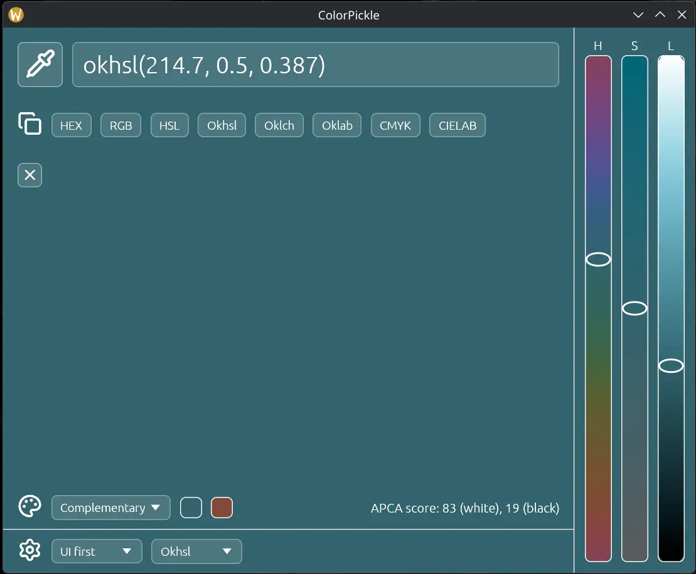

# ColorPickle

Linux screen color picker. Pick a pixel or drag-select a region with a magnified picker, using any common color format. Launch to GUI or straight to picker.



## Features

- Fullscreen picker overlay with a magnified view of the area under the cursor
- Click to pick a single pixel, or drag to select a region and pick its averaged color
- Copy as HEX, RGB, HSL, Okhsl, Oklch, Oklab, CMYK, or CIELAB
- Keyboard shortcuts `1`–`8` copy the respective format
- Input any supported format, or a CSS color name to set the color
- The main window is the current color, with contrast-adjusted controls
- Gradient Hue/Saturation/Lightness sliders
- History of the last 8 picks — click one to reuse it, or clear the list
- Color-harmony swatches (complementary, split complementary, analogous, triadic, tetradic, rectangle) — click a swatch to use it
- Launch-mode and default-format selectors, saved to the config file
- Wayland capture via `ext-image-copy-capture`, falling back to the XDG desktop portal

## Install

[Download latest release](https://github.com/dcog989/ColorPickle/releases/latest) - `.deb`, `.rpm`, or `.AppImage` as needed.

- Arch Linux (AUR): `yay -S colorpickle` (or `paru`)
- Debian/Ubuntu (`.deb`): `sudo apt install ./colorpickle_*.deb`
- Fedora/RHEL/openSUSE (`.rpm`): `sudo dnf install ./colorpickle-*.rpm`
- AppImage (any distro): `chmod +x ColorPickle-*.AppImage ./ColorPickle-*.AppImage`

> [!NOTE]
> On KDE Plasma, running the app from AppImage prevents use of the fast *ScreenShot2*. It therefore falls back to a slower method, such as XDG desktop portal.

## Install from source

Clone this repository:

```sh
cargo build --release

sudo install -Dm755 target/release/colorpickle /usr/bin/colorpickle
sudo install -Dm644 packaging/colorpickle.desktop /usr/share/applications/colorpickle.desktop
sudo install -Dm644 packaging/colorpickle.svg /usr/share/icons/hicolor/scalable/apps/colorpickle.svg
sudo install -Dm644 assets/colorpickle.png /usr/share/icons/hicolor/256x256/apps/colorpickle.png
sudo update-desktop-database /usr/share/applications
```

## Build

```sh
cargo build                              # debug build
cargo check                              # type-check only
cargo clippy --workspace --all-targets -- -D warnings
cargo fetch && cargo outdated -w         # check for updates above semver range
cargo fmt --check                        # formatting check
cargo fmt                                # format all files
cargo run                                # build and run
cargo test --workspace                   # tests
cargo build --release                    # release build
cargo upgrade && cargo update --verbose  # update Cargo.lock and dependencies to latest with semver ranges

cargo clean && rm -rf target/            # clean build artifacts
```

## Packaging

```sh
cargo install cargo-deb cargo-generate-rpm   # once
packaging/build.sh                           # .deb, .rpm and AppImage into target/
```

## License

GPL-3.0-only. See [LICENSE](LICENSE).
